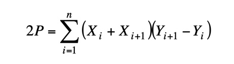
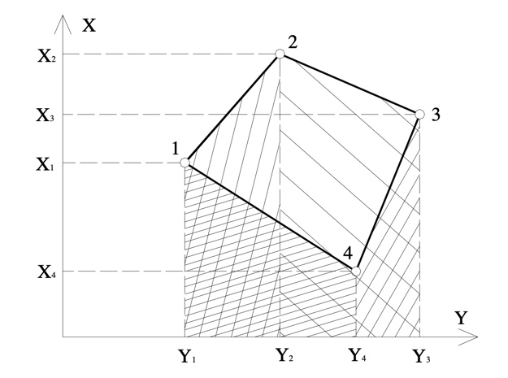

# SurfaceArea

The program is used to calculate the surface area of a figure described in the XY coordinate system.
An analytical method of determining the field based on Gauss formulas was used.

Calculation of area based on trapezoids with bases parallel to the X axis and trapezoids with bases parallel to the Y axis.

Check how easy it is!
Just import a basic math library.
